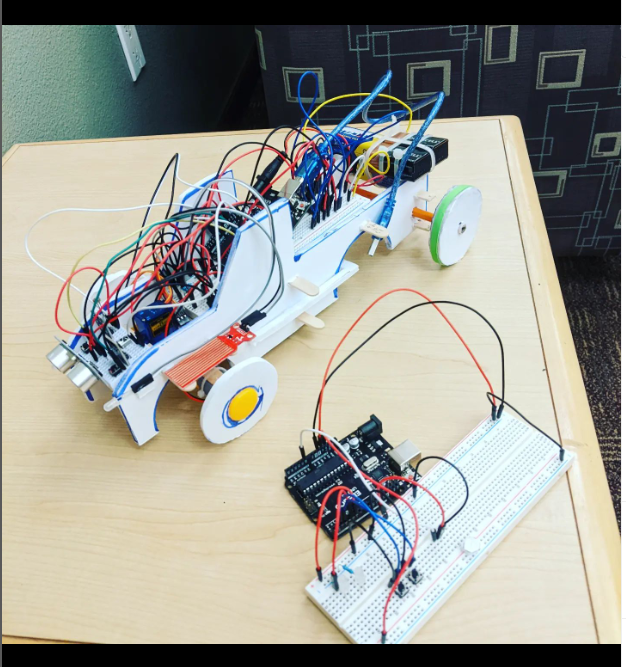

# BARJ_NERDS
A Avenue E project
Summer 2022
https://www.youtube.com/watch?v=QybXbo2XOUA&ab_channel=BenT

# Driver Assistive Systems [DAS]

##Background
Some of the best systems are automated to create a safe experience for all drivers on
the road. Examples like ABS, automatic braking system and TC or traction control perform very
well in the background of day to day driving and require little user input. We propose to
automate two additional systems. Headlight brightness and cruise control. The less features of a
car the driver has to monitor, the better and this leaves the driver to concentrate on the road
ahead to make other critical decisions. DAS aims to automate headlight brightness to change
for different conditions such as weather, time of day and oncoming traffic. Additionally, we aim to
automate the existing cruise control by adding intelligence to the system so that the cruise
control will change the vehicle’s speed automatically when driving through areas with different
speed limits.

## Proposed Solution

For the headlight brightness controller of DAS the inputs will include incoming light from
the sun, time of day from a clock, light from oncoming traffic, temperature and humidity. With
this suite of sensors combined the LED headlight brightness will illuminate at its highest settings
at night and in areas of darkness. The LED will turn on to medium intensity when oncoming
traffic or a car ahead is present. The systems will also turn on when the temperature dewpoint
spread is within a few degrees, indicating rain is imminent.
For the cruise control system of DAS the input will require AI assisted intelligence that is
fed optically with data from road signs. Using this information the cruise control will accelerate or
slow down to the posted speed when traveling through areas with different speed limits.

# Plan for prototype
## Phase 1: Implement the headlight system of DAS
- DHT11 (Calculate temperature dewpoint spread from temperature and humidity)
- Photoresistor (Detect light intensity from other cars and sun)
- Clock module (Used in conjunction with other sensors to turn system on)
- LEDs for intensity(1 low, 2 medium, 3 high)
## Phase 2: Implement the automatic cruise control of DAS
- Motor (Simulates car velocity)
- Motor controller (Controls car “velocity”)
- Potentiometer (User input to control car “velocity”)
- 3 buttons (Each correspond to different speed limits “detected” by AI sensors)
- Switch (Turns on/off automatic cruise control)
